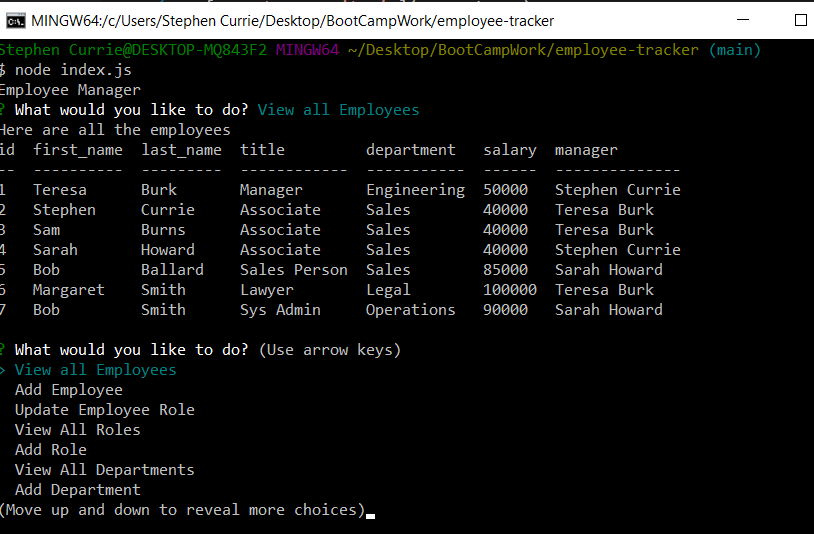

# Employee Tracker

## Description

This code creates and updates a MySQL database by getting input from the command prompt.  The database has multiple tables that were seeded with a few entries. The tables have primary and foreign keys to reference each other and allow tables to interact with each other.  The code uses Inquirer, MySql2, and Console Table from Node Packet Manger (npm).

To run the code, run "node index.js" 

## Table of Contents

- [Screenshots and Links](#screenshots)
- [Acceptance Criteria](#acceptance)
- [What I Learned](#learned)

## ScreenShots

Below is a screenshot of the application running in the command prompt.

Here is a video of what the application looks like running in the command prompt. [Video](https://drive.google.com/file/d/13qp11P7qfCZh2ZXX3AXqQ_J2mBJPMkY8/view)

The code is in the [GitHub Repository](https://github.com/stephencurrie/employee-tracker)

## Acceptance

The following were the acceptance criteria for the project:

- [x] When I start the application, I am presented with the following options: view all departments, view all roles, view all employees, add a department, add a role, add an employee, and update an employee role
- [x] When I choose to view all departments, I am presented with a formatted table showing department names and department ids
- [x] When I choose to view all roles, I am presented with the job title, role id, the department that role belongs to, and the salary for that role
- [x] When I choose to view all employees, I am presented with a formatted table showing employee data, including employee ids, first names, last names, job titles, departments, salaries, and managers that the employees report to
- [x] When I choose to add a department, I am prompted to enter the name of the department and that department is added to the database
- [x] When I choose to add a role, I am prompted to enter the name, salary, and department for the role and that role is added to the database
- [x] When I choose to add an employee, I am prompted to enter the employee’s first name, last name, role, and manager, and that employee is added to the database
- [x] When I choose to update an employee role, I am prompted to select an employee to update and their new role and this information is updated in the database 

## Learned

The following is a list of things I learned:

- How to install MySQL
- How to use create a database and then multiple tables within that database
- How to link tables together with primary and foreign keys
- How to use MySQL queries such as: SELECT, UPDATE, JOIN, INSERT INTO, CONCAT
- How to seed a database
- How to print to the console with Console Table
